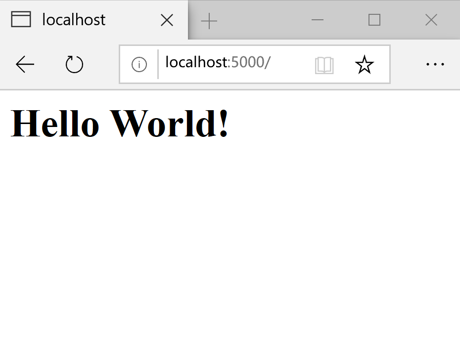
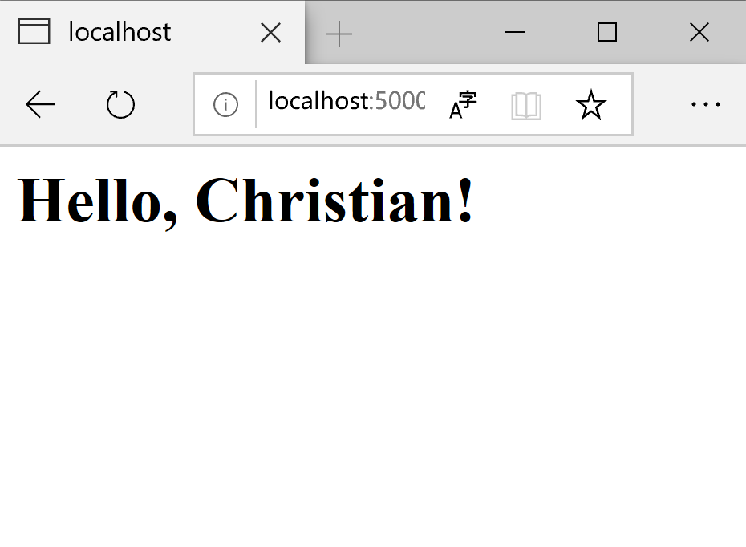

# Learning Note 
Author: Christian  
Date: 2019.10.01 - 2019.10.09 
***
## 1. Markdown

- Editor: VS Code
- Extension: Markdown PDF, Markdown Preview Enhanced
- Learning Reference: [<u>RUNOOB.COM</u>](https://www.runoob.com/markdown/md-tutorial.html)

## 2. Marp

- Editor: VS Code
- Extension: Marp for VS Code
- Learning Reference: [<u>Marp Official Website</u>](https://marp.app/blog)
- Demo:

## 3. Git

- Learning Reference: [<u>Git Official Document</u>](https://git-scm.com/doc), [<u>Liao Xuefeng's blog</u>](https://www.liaoxuefeng.com/wiki/896043488029600)

## 4. Flask

- Clone the repository on the Github. Run the example in the virtual environment.

- Learning Reference: *Flask Web Development* (2018)   

- Environment: Windows 10 (Run Flask in the virtual environment) 

- Source Code: [<u>Flasky</u>](https://github.com/miguelgrinberg/flasky.git)

- Example:

    Import the module Flask.

        from flask import Flask

    This statement is use to stantiate the class Flask. 
    The constructor function needs one parameter: the name of main module. 
    
        app = Flask(__name__)

    Connect to the URL.

        @app.route('/')
        def index():
            return '<h1>Hello World!</h1>'    
    
    Connect to the subdirectory of URL.

        @app.route('/user/<name>')
        def user(name):
            return '<h1>Hello, {}!</h1>'.format(name)
- Demo:  
  

